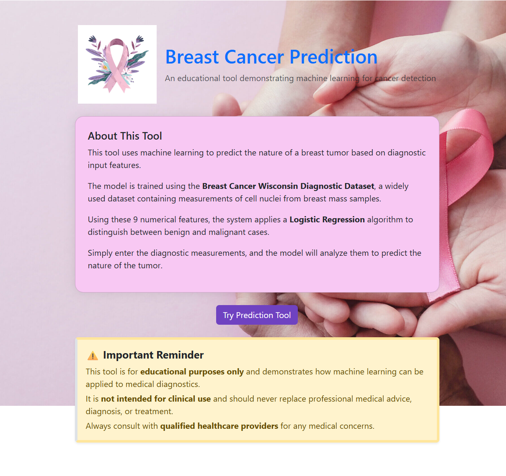
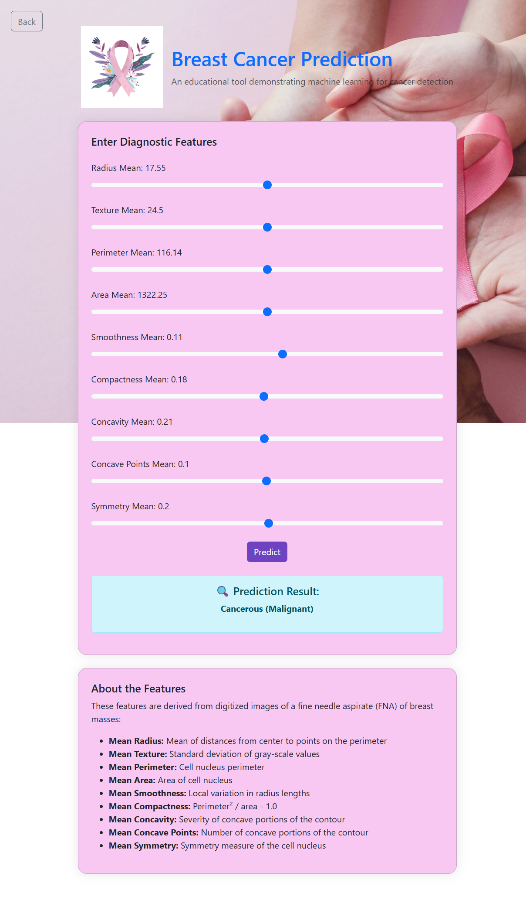

<div align="center">

# 🎗️ Breast Cancer Prediction System

### An End-to-End Machine Learning Web Application for Early Cancer Detection

[](https://python.org)
[](https://flask.palletsprojects.com)
[](https://scikit-learn.org)
[](LICENSE)
[]()

<br/>

> **Empowering early diagnosis through intelligent machine learning** — predicts whether a breast tumor is **Malignant** or **Benign** with ~94.7% accuracy using a trained Logistic Regression model, deployed as an interactive Flask web application.

<br/>

</div>

---

## 📋 Table of Contents

- [About the Project](#-about-the-project)
- [Key Features](#-key-features)
- [Tech Stack](#-tech-stack)
- [Project Architecture](#-project-architecture)
- [Dataset](#-dataset)
- [Model Performance](#-model-performance)
- [Getting Started](#-getting-started)
- [Usage](#-usage)
- [Project Structure](#-project-structure)
- [Screenshots](#-screenshots)
- [Future Improvements](#-future-improvements)
- [Contributing](#-contributing)
- [License](#-license)


---

## 🔬 About the Project

Breast cancer is one of the most common cancers worldwide, and **early detection is the single most important factor** in improving survival rates. This project bridges the gap between data science and healthcare by building a production-ready ML pipeline that classifies tumors with high accuracy.

The system accepts 9 clinical tumor features as input and instantly predicts whether the tumor is:

| Prediction | Meaning |
|---|---|
| ✅ **Benign** | Non-cancerous — no immediate threat |
| ⚠️ **Malignant** | Cancerous — requires medical attention |

This project demonstrates a **complete ML lifecycle**: from data preprocessing and model training to serialization and deployment via a web interface — making it an ideal showcase of applied machine learning engineering.

---


## ✨ Key Features

- 🧠 **Trained ML Model** — Logistic Regression achieving ~94.7% test accuracy
- ⚡ **Real-Time Prediction** — Instant classification through a responsive Flask web app
- 📐 **Feature Scaling** — StandardScaler applied for improved model performance
- 💾 **Model Persistence** — Pre-trained `model.pkl` and `scaler.pkl` for fast inference
- 🌐 **Web Interface** — Clean, user-friendly HTML/CSS frontend via Jinja2 templates
- 🛡️ **Error Handling** — Robust input validation with descriptive error messages
- 📊 **Reproducible Pipeline** — Modular training script for easy retraining

---

## 🛠️ Tech Stack

| Layer | Technology | Purpose |
|---|---|---|
| **Language** | Python 3.8+ | Core development |
| **ML Framework** | Scikit-learn | Model training & evaluation |
| **Web Framework** | Flask | REST API & web server |
| **Data Processing** | NumPy, Pandas | Feature engineering & preprocessing |
| **Model Storage** | Pickle | Serialization of model & scaler |
| **Frontend** | HTML5, CSS3, Jinja2 | User interface & templating |

---

## 🏗️ Project Architecture

```
User Input (9 Features)
        │
        ▼
 Flask Web App (app.py)
        │
        ▼
StandardScaler (scaler.pkl)   ← Normalize input features
        │
        ▼
Logistic Regression (model.pkl) ← Trained classifier
        │
        ▼
 Prediction Output
  ┌─────┴─────┐
  ▼           ▼
Benign    Malignant
```

The pipeline follows industry best practices:
1. **Data ingestion** from the UCI Breast Cancer Wisconsin dataset
2. **Preprocessing** — null checks, label encoding, train/test split (80/20)
3. **Feature scaling** via `StandardScaler`
4. **Model training** with Logistic Regression
5. **Serialization** of both model and scaler
6. **Flask deployment** — user submits features via form → scaled → predicted → result rendered

---

## 📊 Dataset

| Property | Detail |
|---|---|
| **Source** | UCI Breast Cancer Wisconsin Dataset |
| **File** | `breast-cancer.csv` |
| **Samples** | 569 instances |
| **Features** | 9 clinical tumor attributes |
| **Target** | Binary — Malignant (1) / Benign (0) |
| **Missing Values** | None |

**Input Features Used:**

```
1. Clump Thickness
2. Uniformity of Cell Size
3. Uniformity of Cell Shape
4. Marginal Adhesion
5. Single Epithelial Cell Size
6. Bare Nuclei
7. Bland Chromatin
8. Normal Nucleoli
9. Mitoses
```

---

## 📈 Model Performance

| Metric | Value |
|---|---|
| **Algorithm** | Logistic Regression |
| **Train/Test Split** | 80% / 20% |
| **Test Accuracy** | **~94.7%** |
| **Preprocessing** | StandardScaler normalization |

> The model was evaluated on a held-out test set and demonstrates strong generalization for binary medical classification.

---

## 🚀 Getting Started

### Prerequisites

Ensure you have the following installed:

- Python 3.8 or higher
- pip (Python package manager)
- Git

### Installation

**1. Clone the repository**

```bash
git clone https://github.com/Rohitgurjar345/Breast-cancer-Prediction.git
cd Breast-cancer-Prediction
```

**2. Create and activate a virtual environment** *(recommended)*

```bash
# Windows
python -m venv env
env\Scripts\activate

# macOS / Linux
python -m venv env
source env/bin/activate
```

**3. Install dependencies**

```bash
pip install -r requirements.txt
```

**4. Run the application**

```bash
python app.py
```

**5. Open in your browser**

```
http://127.0.0.1:5000
```

---

## 💻 Usage

### Web App

1. Navigate to `http://127.0.0.1:5000`
2. Click **"Get Prediction"** to open the input form
3. Enter values for all 9 tumor features
4. Submit the form and receive an instant prediction:
   - ✅ `Not Cancerous (Benign)`
   - ⚠️ `Cancerous (Malignant)`

### Retrain the Model

To retrain from scratch on the provided dataset:

```bash
python breast_cancer_classification_using_machine_learning.py
```

This will generate updated `model.pkl` and `scaler.pkl` files.

---

## 📁 Project Structure

```
Breast-cancer-Prediction/
│
├── 📂 docs/                   # HTML templates (Jinja2)
│   └── index.html
│
├── 📂 static/                 # CSS and static assets
│
├── 📂 images/                 # Project screenshots / visuals
│
├── 📂 env/                    # Virtual environment (not tracked)
│
├── 🐍 app.py                  # Flask web application & routes
├── 🐍 breast_cancer_classification_using_machine_learning.py
│                              # Model training pipeline
├── 📊 breast-cancer.csv       # Raw dataset (UCI Wisconsin)
├── 🤖 model.pkl               # Serialized trained model
├── ⚖️  scaler.pkl              # Serialized StandardScaler
├── 📄 requirements.txt        # Python dependencies
└── 📖 README.md               # Project documentation
```

---


## 📸 Screenshots

### 🖥️ Application Interface


### 🔍 Prediction Output


## 🔮 Future Improvements

- [ ] 🔄 Add support for additional ML algorithms (Random Forest, SVM, XGBoost) with model comparison
- [ ] 📊 Integrate a data visualization dashboard (Matplotlib / Plotly)
- [ ] 🧪 Add unit tests and CI/CD pipeline (GitHub Actions)
- [ ] ☁️ Deploy to cloud (Heroku / AWS / Render) with live URL
- [ ] 📱 Make the frontend fully responsive for mobile devices
- [ ] 🔐 Add input validation with detailed field-level error messages
- [ ] 📋 Include a full model evaluation report (Confusion Matrix, ROC-AUC, F1)

---

## 🤝 Contributing

Contributions are what make the open-source community such an amazing place to learn and grow. Any contributions you make are **greatly appreciated**.

1. Fork the repository
2. Create your feature branch: `git checkout -b feature/AmazingFeature`
3. Commit your changes: `git commit -m 'Add some AmazingFeature'`
4. Push to the branch: `git push origin feature/AmazingFeature`
5. Open a Pull Request

---

## 📄 License

Distributed under the **MIT License**. See [`LICENSE`](LICENSE) for more information.


> 📌 *If you found this project helpful, please consider giving it a ⭐ — it means a lot!*

---

<div align="center">

*This project is intended for educational purposes only and is not a substitute for professional medical advice.*

</div>